# Sampling-Based Planning: RRT Variants

Implementations of RRT-Extend, RRT-Connect, and Bidirectional RRT-Connect for a holonomic point robot. The planners work in any dimension, assuming the robot is holonomic. This demo defines the space as (x, y) with line-segment obstacles so the paths can be visualized. Extending this to a higher dimensional space would require updating the sampling, distance metric, and collision checking method.

The three planners are compared on four maps: a serpentine wall map, and three narrow passage maps where the start and goal are placed differently.

## Motivation

Planning in a higher dimensional space is hard, and the complexity of complete methods increases with dimension.

- Exact methods are complete over continuous C-space, but require computing C-space obstacles, which is expensive in high-dimensional spaces.

- Discrete-search methods, like A*, are complete over a graph and optimal (given an admissible heuristic). The branching factor (number of successors at each node) increases with dimension, making the graph expensive to search.

- Sampling methods like PRM explore the connectivity of the whole space, which is expensive when you only need one path from a start to a goal.

RRT weakens the requirements of complete and optimal to probabilistically complete and feasible.

- **Complete:** always finds a solution, or prove none exists.

- **Optimal:** always returns the lowest-cost solution.

- **Probabilistically Complete:** given a solvable problem, the probability of finding a solution goes to 1 as time goes to infinity.

- **Feasible:** The solution respects all constraints (C-space obstacles).

## Implementation

Rapidly-exploring random trees (RRT) [1] is a sampling-based planner. Rather than discretizing the configuration space, it samples random points and grows a tree from the start configuration toward each sample, incrementally exploring the space until the tree reaches the goal.

**RRT-Extend**
- Take one step toward the random sample.

**RRT-Connect**
- Continue stepping toward the random sample until it is either reached or blocked by an obstacle.

**Bidirectional RRT-Connect**
- Grow trees from both start and goal, with connect extension on both.
- Each iteration, one tree grows toward a random sample and the other grows toward that tree's new node. The trees swap roles each iteration.

## Results

Each planner was run on 100 seeds per map. The plots show one seed. The map is 10 x 10, the step size is 0.5, and the single-tree planners use a goal bias of 0.05. The results are medians. An iteration is one sample. Runs stop at 10,000 iterations, and failed runs count toward the median iterations. A collision check is one call to the collision checker, including checks done in smoothing. Nodes is the tree size.

**Walls**

<p align="center">
  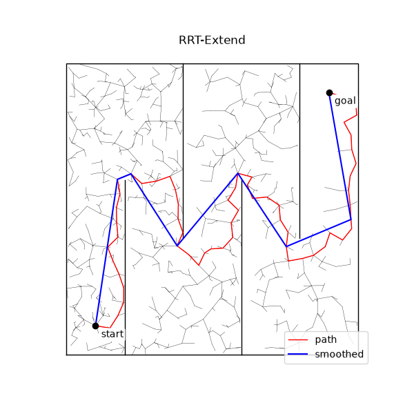
  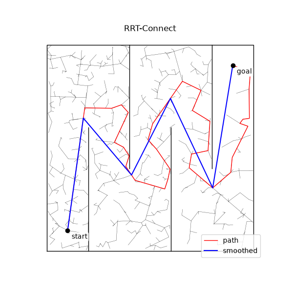
  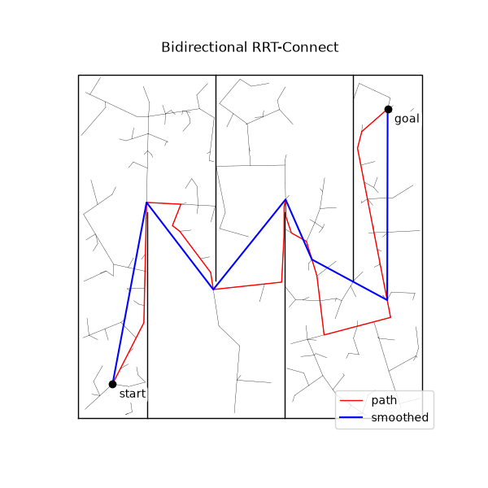
</p>

The serpentine wall map is a classic map to visualize planner behavior in the general case. Each tree has to reach one opening before it can start looking for the next, and it keeps growing in the sections it has already entered. The openings are wide, so the difficulty is finding them in sequence. 

Each planner was successful in finding a path across all seeds. RRT-Extend had the most iterations, collision checks, and nodes in the tree, since each sample only takes a single step. RRT-Connect had lower iterations, collision checks, and nodes in the tree, since the connect extension more aggressively connects the samples to the tree, and a single sample can carry the tree to a new section. Bidirectional RRT-Connect had the lowest iterations, collision checks, and nodes in the tree, since each tree only has to cover about half the sections before they meet. While bidirectional had the lowest cost, connect's aggressive step style means the path was coarser. The smoother only shortcuts between points already on the path, so RRT-Extend's dense path gave it more points to work with and produced the shortest smoothed path.

```
RRT-Extend
  success rate:      100%
  median iterations: 1700
  median checks:     2343
  median nodes:      1044
  median raw length: 29.32
  median smoothed:   22.17
RRT-Connect
  success rate:      100%
  median iterations: 998
  median checks:     1768
  median nodes:      714
  median raw length: 33.03
  median smoothed:   24.04
Bidirectional RRT-Connect
  success rate:      100%
  median iterations: 535
  median checks:     1531
  median nodes:      336
  median raw length: 32.66
  median smoothed:   24.79
```

**Open rooms with tunnel**

<p align="center">
  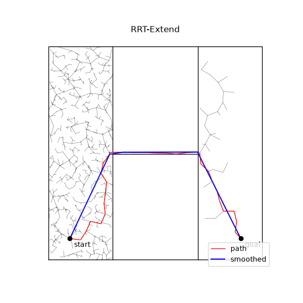
  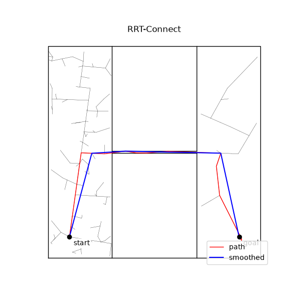
  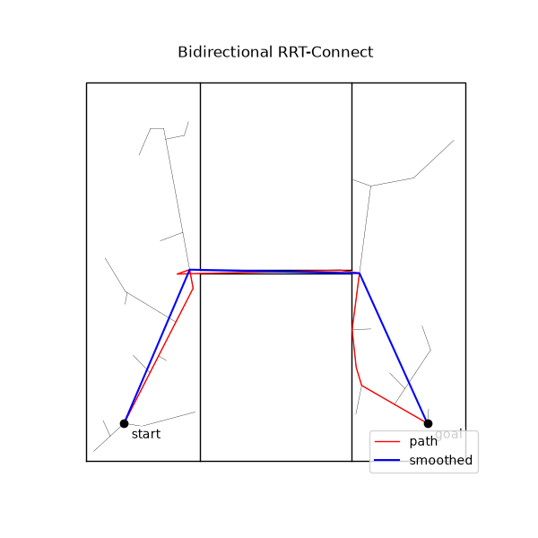
</p>

The open rooms with tunnel map has two open sections separated by a narrow passage (tunnel). The start and goal were placed away from the narrow passage to expose the difficulty of finding the openings and getting through.

Each planner had unsuccessful attempts in this map. The success rate from lowest to highest was: RRT-Extend, RRT-Connect, Bidirectional RRT-Connect. This is due to how each planner has to cross the narrow passage. RRT-Extend needs a sequence of rare samples that keep pulling it forward inside the passage, leading to the largest amount of the start section being searched and max iterations being reached in some seeds. RRT-Connect only needs one sample on the far side that aligns with the passage, since a single connect can carry it all the way through, making it more likely to find a way through the passage and giving it a higher success rate than RRT-Extend. Bidirectional RRT-Connect grows both trees to the passage openings. Once one tree enters the passage, the other connects directly toward its newest node rather than waiting for a lucky sample like RRT-Connect, so the chance of joining is higher.

The cost of each planner is similar to the serpentine wall map, with costs from highest to lowest being RRT-Extend, RRT-Connect, Bidirectional RRT-Connect.


```
RRT-Extend
  success rate:      79%
  median iterations: 2558
  median checks:     3060
  median nodes:      805
  median raw length: 15.03
  median smoothed:   13.15
RRT-Connect
  success rate:      82%
  median iterations: 2094
  median checks:     2610
  median nodes:      691
  median raw length: 15.90
  median smoothed:   13.29
Bidirectional RRT-Connect
  success rate:      87%
  median iterations: 1150
  median checks:     2046
  median nodes:      480
  median raw length: 17.83
  median smoothed:   13.53
```

**Start in tunnel**

<p align="center">
  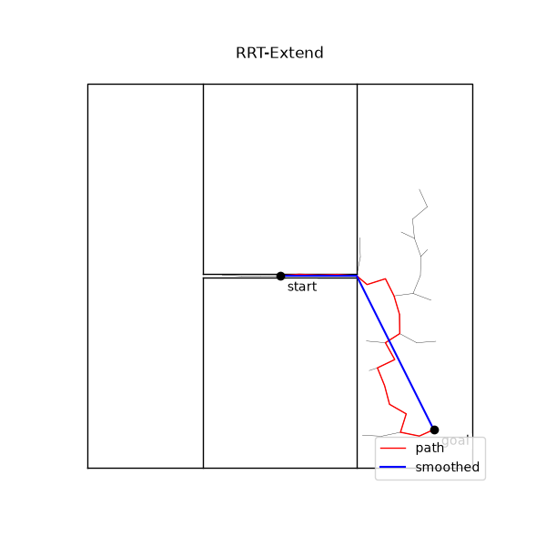
  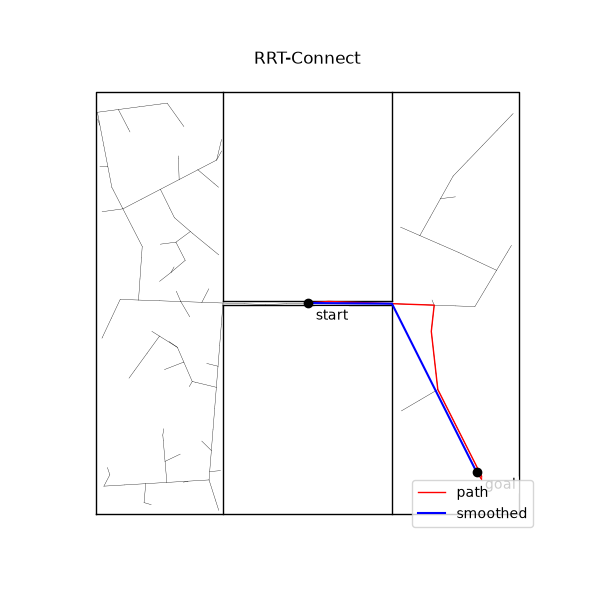
  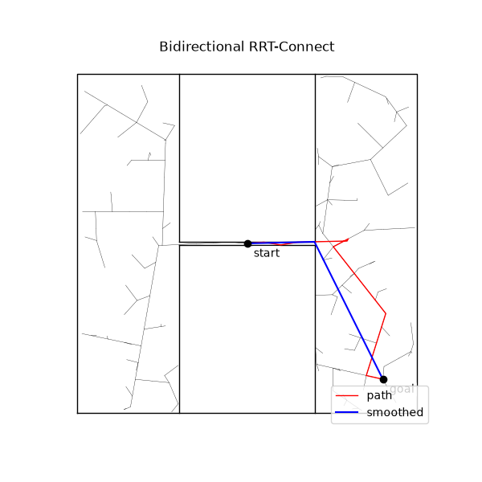
</p>

This map places the start inside of the narrow passage and goal inside of an open room. This was meant to stress the sampling to see how the planners could escape the passage.

While it appears that RRT-extend had the simplest tree, it had the highest computation with 66 nodes and 554 collision checks. RRT-Connect had a similar result with 62 nodes and 440 collision checks. Bidirectional RRT had the fewest computation cost, but not by much, with 55 nodes and 360 collision checks. The reason Connect's and Bidirectional-Connect's tree appears larger, but has fewer nodes is because the nodes are only counted as the end points of the connection step. 

Shown above, Extend appears to have a more directed path toward the goal, while Connect and BiDirectional-Connect appear to be exploring the wrong room. This is and example of the Voronoi Bias being amplified by the Connect step. The Voronoi bias is the core mathematical mechanism that allows a Rapidly-exploring Random Tree (RRT) to aggressively expand into unexplored areas, and a few samples in the incorrect room is more likely to draw the tree outside of the passage with Connect, where as Extend requires a unrealistic amount of lucky samples perfectly aligned with the path to draw the tree outside of the narrow passage.

All trees were successful in finding the goal within the maximum iterations. While sampling was stressed, beginning inside the narrow passage tends to be easier than a finding a goal inside of the passage, which is discussed in the next section.

```
RRT-Extend
  success rate:      100%
  median iterations: 312
  median checks:     554
  median nodes:      66
  median raw length: 7.30
  median smoothed:   6.48
RRT-Connect
  success rate:      100%
  median iterations: 127
  median checks:     440
  median nodes:      62
  median raw length: 7.88
  median smoothed:   6.75
Bidirectional RRT-Connect
  success rate:      100%
  median iterations: 55
  median checks:     360
  median nodes:      50
  median raw length: 8.87
  median smoothed:   6.59
```

**Goal in tunnel**

<p align="center">
  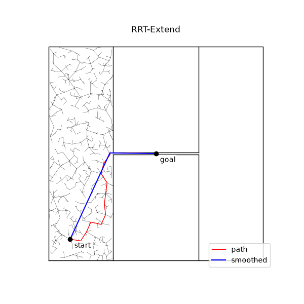
  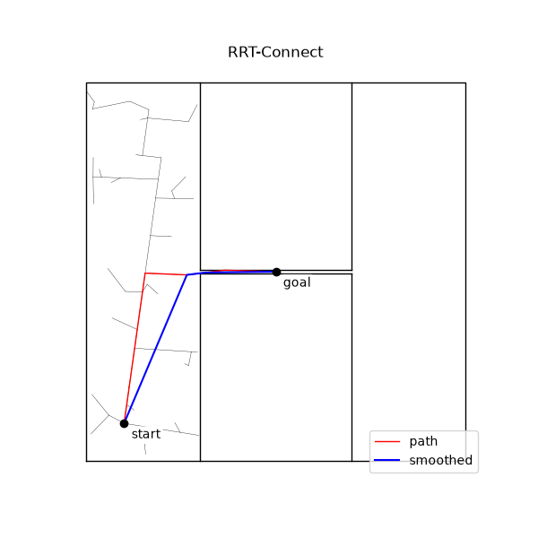
  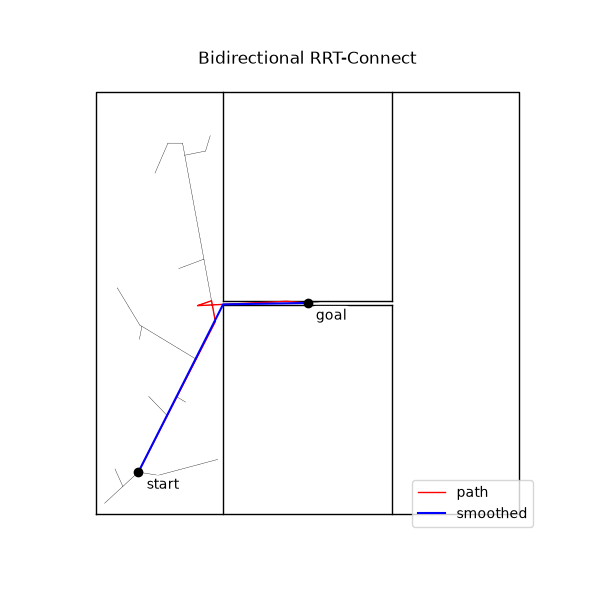
</p>

This scenario places the start inside of an open room and goal inside of the narrow passage. This was meant to isolate finding the passage from the first scenario where both start and goal started in open rooms. Unlike the scenario above which each planner was successful, this scenario shows clear advantages of Bidirectional RRT-Connect. 

RRT-Extend and RRT-Connect had similar success rates of 81-82%, and similar computation costs of 2500-2600 nodes explored and 2600-2800 collision checks. BiDictional RRT-Connect had a 100% success rate, with significantly lower computational costs of 64 nodes and 408 collision checks. This is due to Bidirectional search nature of growing a tree from both sides. The advantage here is that BiDirectional can grow a tree to escape the narrow passage, while the other planners cannot. The other planners growing the trees from the start and rely on lucky samples to discovering the passage.

The difference in results between this scenario and the open rooms scenario comes down to sampling. Here Bidirectional-Connect was able to start a tree from the passage, whereas in the open rooms Bidirectional-Connect had to discover the passage. The open room scenario more stressed by sampling, and the planner to sample a path through a longer corridor to connect the trees in limited iterations, which led to lower success rates. Overall, this shows a real advantage of Bidirectional planners in scenarios with a start or goal inside the narrow passage.

```
RRT-Extend
  success rate:      81%
  median iterations: 2498
  median checks:     2746
  median nodes:      753
  median raw length: 7.73
  median smoothed:   6.52
RRT-Connect
  success rate:      82%
  median iterations: 2332
  median checks:     2616
  median nodes:      742
  median raw length: 7.93
  median smoothed:   6.53
Bidirectional RRT-Connect
  success rate:      100%
  median iterations: 100
  median checks:     408
  median nodes:      64
  median raw length: 9.15
  median smoothed:   6.77
```
  

## Running the code

```bash
python3 -m venv venv
source venv/bin/activate
python3 -m pip install -r requirements.txt
```

```bash
python3 demo.py
python3 benchmark.py
```


## References

[1] S. M. LaValle, "Rapidly-Exploring Random Trees: A New Tool for Path Planning,"
Technical Report TR 98-11, Computer Science Department, Iowa State University, Oct. 1998.
